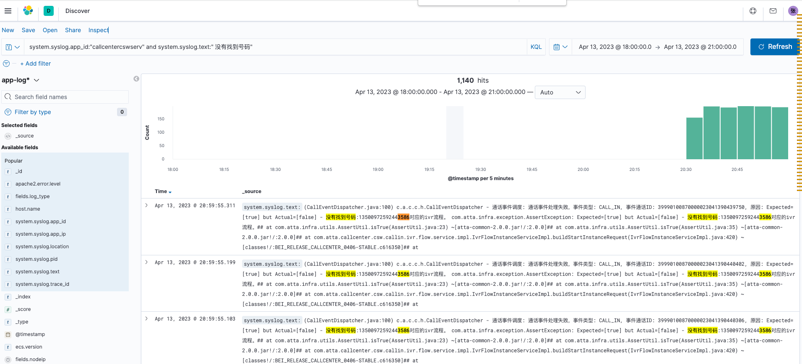

# **需求评审：**

- 确定需求范围，哪些做哪些不做，哪些是团队内做，哪些是外部团队做。

# **接口测试**

场景：更新客服流程管理

## **接口参数**

### **入参**

- 参数定义是否冗余

  ```json
  {
      "id":1000508,
      "name":"客服流程1681294200", //冗余
      "flowKey":"ivr-20230329-429520",
      "flowName":"呼入测试流程勿删0329副本", //冗余
      "joinNumbers":[
          "16812942005",
          "16812942006"
      ],
      "version":1,
      "createdBy":"SuperBoss-1",    //冗余
      "createdTime":1681294206000,  //冗余
      "_index":5,    //冗余
      "_rowKey":38   //冗余
  }
  ```

- 数据类型校验

- 边界值校验

- 有效性校验

  - id校验

  - flowKey校验

    - flowkey 是否生效
    - flowkey是否存在
    - ...

  - joinNumbers校验

    - 号码格式
    - 号码是否重复
    - ...

  - 枚举类型校验

  - 参数定义的合理性

    - 例子：呼出接口callout,业务方传号码即可，但是当前传的为leadsID，然后拿到 leadsId再去业务方那边查出号码，然后呼出。

      ```json
      {
          "callOutReferenceId":"13990100166000023041900033464",
          "domain":"CUSTOMER_SERCICE",
          "contactId":"13990100166000023041900033464",
          "scene":"CUSTOMER_SERCICE_WORKORDER"
      }
      ```

      

### **出参**

- 返回值校验
- 统一的返回格式校验
- 错误码(错误信息)校验
  - 业务预定义错误码+错误信息


## **接口逻辑**

### **写入逻辑**

- 写入目标表
- 数据预处理是否正确
- 重复写入
  - 是多条数据还是一条数据
- 数据幂等

### **查询逻辑**

- 数据结果是否符合预期
- 读取表是否正确
- 读取字段是否正确

## **数据库**

表定义是否符合预期


# **预警机制**

例子,4.13 号新增香港站业务，所以新增两台 Freeswitch，且网络未做限制，然后被攻击。



建立预警机制：比如向 ivr 超过 50 次找不到对于 ivr流程就告警或者啥的