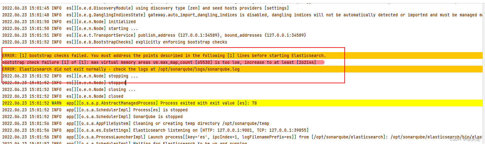

***本地环境配置***

>System: Ubuntu 18.04 LTS
>
>SonarQube: 8.9.10 LTS

***问题发现***

错误信息：``max virtual memory areas vm.max_map_count [65530] is too low, increase to at least [262144]``

***解决方案***

- 配置 /etc/sysctl.conf文件, 添加配置 vm.max_map_count=262144

- 使用命令 sysctl -p ,让配置立即生效

- 重启SonarQube, 成功运行

