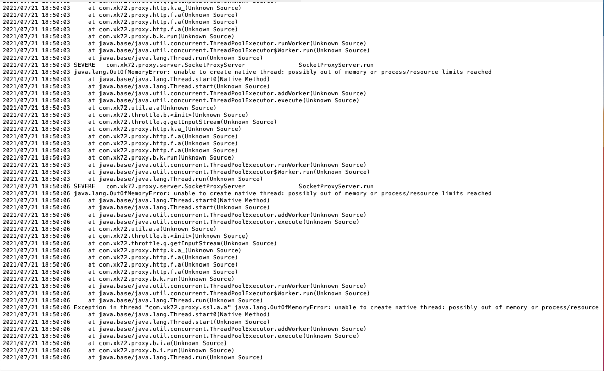
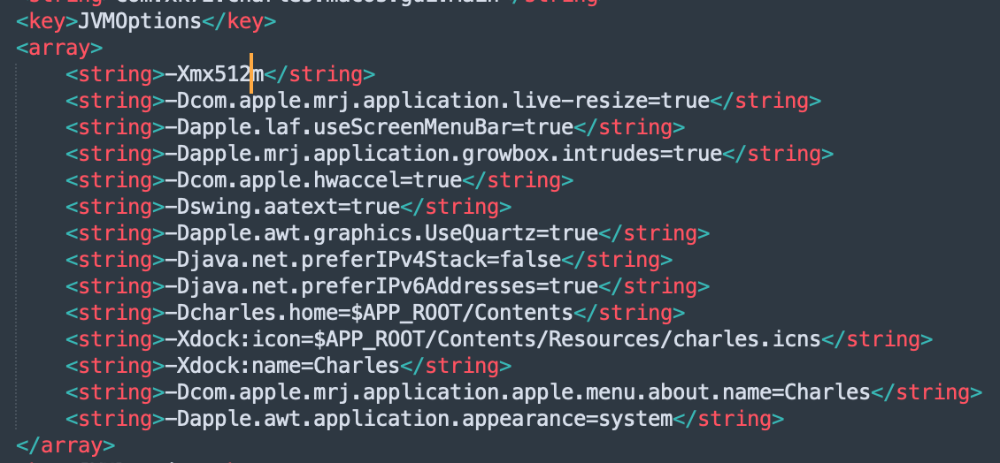

***本地环境配置:***

> Charles: v4.6.2
>
> System: macOS Monterey 12.1
>
> CPU: Intel Core i7

***问题发现:***

使用Charles长时间持续抓包后,查看error log 文件发现出现OOM。

***解决办法：***

参考[官网文档](https://www.charlesproxy.com/documentation/faqs/charles-runs-out-of-memory/)中说明:

>**Charles runs out of memory**
>
>After recording for a while Charles will run low on available memory. To free up memory you should clear the current session.
>
>If you frequently run out of memory you can increase the default heap size.
>
>**Windows**
>
>Edit C:Program FilesCharlesCharles.ini and change vm.heapsize.preferred to a higher number. Be sure not to remove any other the letters or symbols around the numbers!
>
>**Mac OS X**
>
>Find Charles.app in your Applications folder, right click and choose Show Package Contents. Open the Contents folder and open Info.plist in a text editor, such as Text Edit. Find VMOptions and change the number in -Xmx256m. Be sure not to remove any other the letters or symbols around the numbers!
>
>**Linux**
>
>Edit the charles.sh file and change the number in -Xmx256m. Be sure not to remove any other the letters or symbols around the numbers!

但是,实际在mac上打开Charles包文件夹下Contents中的Info.plist文件,并没有VMOptions参数,只有一个JVMOptions参数。在array中添加并修改配置项-Xmx256m中的数字大小.

