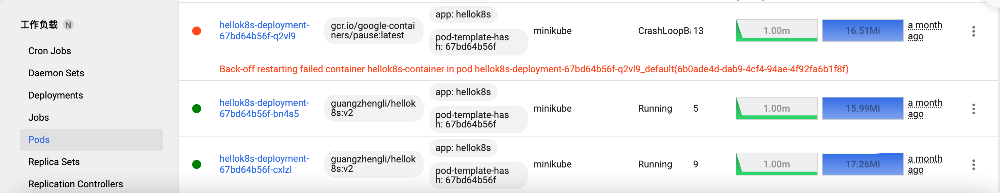
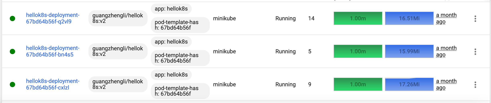

# Minkube 安装 chaos mesh

参考：[chaos mesh官方文档](https://chaos-mesh.org/zh/docs/)

启动 minikube

```bash
minikube start
```

创建 chaos mesh命名空间
```bash
kubectl create ns chaos-mesh
```

helm安装 chaos mesh
```bash
helm install chaos-mesh chaos-mesh/chaos-mesh -n=chaos-mesh
```

验证 chaos mesh安装
```bash
kubectl get po -n chaos-mesh
```

开启 Chaos Mesh dashboard
```bash
kubectl port-forward -n chaos-mesh svc/chaos-dashboard 2333:2333
```

访问地址：http://localhost:2333/dashboard


# 模拟 Pod 故障

进入 Chaos mesh Dashboard。创建一次实验。

本次 Chaos 详细信息：


```yml
kind: PodChaos
apiVersion: chaos-mesh.org/v1alpha1
metadata:
  namespace: default
  name: example.com
  annotations:
    experiment.chaos-mesh.org/pause: 'true'
spec:
  selector:
    namespaces:
      - default
    labelSelectors:
      app: hellok8s
  mode: one
  action: pod-failure
```

运行结果：

运行 chaos


结果：




暂停chaos：


结果：




参考：[模拟 Pod 故障](https://chaos-mesh.org/docs/simulate-pod-chaos-on-kubernetes/)
