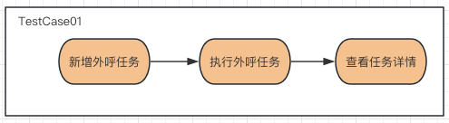

接口测试三步：参数构建、请求响应、断言结果。

先来实现一个简单的场景：

> 新增外呼任务--执行外呼任务--查看外呼任务详情



根据接口测试三步走来实现：

```Java
@Data
@AllArgsConstructor
@NoArgsConstructor
public class AddCallOutTaskModel {
    private String taskName;
  	private String taskType;
}
```

```java
public class BatchCallOutApi {
    private static final String BOSS_USER = BossUser.Admin.getPhone();

  	/**
  	 * 发起请求，获取响应
  	 */
    private String addBatchCallOutTaskApi(ApiCaseModel apiCaseModel) {
        String url = HOST_CALLOUT + "/call-out-task/add";
        return post(url, apiCaseModel);
    }
  
  	/**
  	 * 构造请求参数
  	 */
    public String addBatchCallOutTaskApiBody(AddCallOutTaskModel addCallOutTaskModel) {
        ApiCaseModel apiCaseModel = new ApiCaseModel(BOSS_USER, addCallOutTaskModel);
        return addBatchCallOutTaskApi(apiCaseModel);
    }
}
```

```java
@Slf4j
@Test
public class BatchAiManCallOutApiTest{
  
    @BeforeClass(alwaysRun = true)
    public void setUp() {}

    /**
     * 新增批量外呼任务
     */
    @Test
    @Parameters({"taskName","taskType"})
    public void addBatchAiCallOutTask(String taskName,String taskType) {
        AddCallOutTaskModel addCallOutTaskModel = new AddCallOutTaskModel(taskName,taskType);
      	
        String resp = new BatchCallOutApi().addBatchCallOutTaskApiBody(addCallOutTaskModel);
        JsonObject jsonObject = new Gson().fromJson(resp, JsonObject.class);

        String taskId = jsonObject.get("taskId").getAsString();
      
        Assert.assertEquals(taskName, CallOutTaskDAO.getAiTaskName(taskId), "新增批量外呼任务失败");
    }
  
  	/*
     * 启动批量外呼任务
     */
    @Test(dependsOnMethods = "listBatchAiCallOutTask")
  	@Parameters({"taskId"})
  	public void executeCallOutTask(String taskId) {
        ExecuteCallOutTaskModel executeCallOutTaskModel = new ExecuteCallOutTaskModel(taskId);
      	
        String resp = new BatchCallOutApi().executeCallOutTaskApiBody(executeCallOutTaskModel);
      
        Assert.assertTrue(resp,"启动外呼任务失败");
    }
    /**
     * 批量外呼-人机耦合任务查看详情
     */
    @Test(dependsOnMethods = "listBatchAiCallOutTask")
  	@Parameters({"taskId"})
    public void getBatchAiCallOutTaskInfo(String taskId) {
        NameValuePairModel nameValuePairModel = new NameValuePairModel("taskId", taskId);
        ArrayList<NameValuePairModel> nameValuePairModels = new ArrayList<>();
        nameValuePairModels.add(nameValuePairModel);
        String InfoResp = new BatchCallOutApi().getBatchCallOutTaskInfoApiBody(nameValuePairModels);

        JsonObject jsonObjectInfo = new Gson().fromJson(InfoResp, JsonObject.class);

        Assert.assertEquals(jsonObjectInfo.get("taskStatus").getAsString(), CallOutDAO.getAiTaskStatus(taskId), "查询人机耦合任务状态失败");
    }  
}
```

