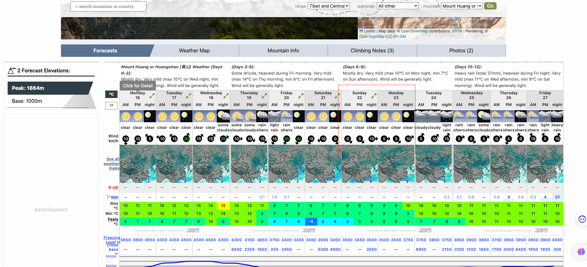

## **出行日期**

日期：10.21~10.22

天气：

## **交通**

- **上海站**高铁---done-->黄山北---doing-->上海站/虹桥站

## **门票&缆车票**

- 订票(门票&缆车票)

- 上山:
  - 云谷索道上行
- 下山：
  - 玉屏索道下行

## **住宿**

- 订票（帐篷/通铺/标间）

- 光明顶/白鹅宾馆，通铺/露营

## **路线**

- **第一天** 黄山南大门入→云谷索道上行→始信峰（开启解锁新的拍照姿势）→黑虎松→梦笔生花→曙光亭→清凉台→猴子观海（找到黄山奇石猴子观海）→狮子峰→团结松→飞来石（摸一摸飞来石）→光明顶→群峰顶（观一场日落）→夜宿山巅

- **第二天** 光明顶（等一次[日出](http://hf.bendibao.com/news/zhuantirichu/)）→步仙桥（步仙桥上走一走）→西海大峡谷网红小火车往返（乘坐西海网红小火车）→鳌鱼峰→百步云梯（挑战百步云梯）→莲花峰（莲花峰上吹吹风）→迎客松（拿迎客松雪糕在迎客松前拍照）→玉屏索道下行→黄山南大门出

(**备选**)

- **第一天** 黄山南大门入→玉屏索道上行→迎客松→莲花峰→百步云梯→鳌鱼峰→西海网红小火车下行→西海大峡谷二环→西海大峡谷一环→排云亭→夜宿黄山顶

- **第二天** 丹霞峰→团结松→清凉台→狮子峰→曙光亭→梦笔生花→黑虎松→始信峰→石笋矼→云谷索道下行→黄山南大门出

## **物资**

- 衣服
- 食物
- 证件

## **参考**

http://www.benluotuo.com/bencandy.php?fid-44-id-100-page-1.htm